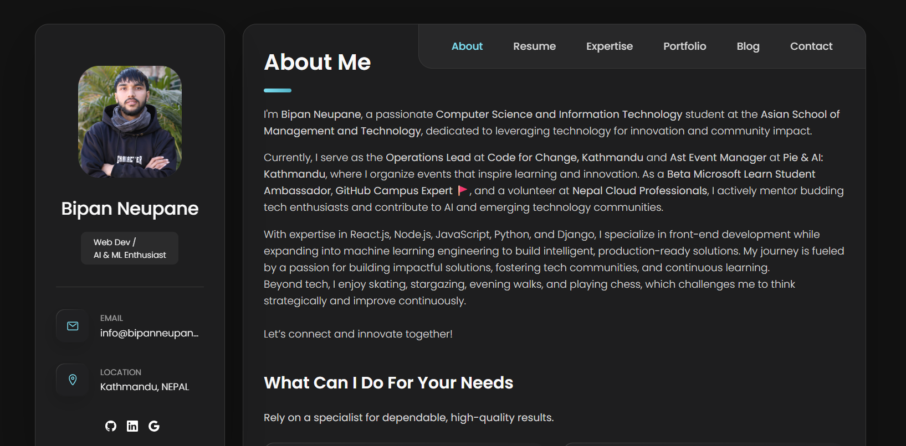

# Bipan Portfolio
This is my personal portfolio and I am a student, , web developer, AI/ML enthusiast and community builder.

## Live
[Portfolio](https://bipanneupane.com.np/)

## Highlights
- About: Hero section with avatar and biography
- Resume: Education, certifications, leadership roles
- Skills: Filterable skill chips
- Portfolio: Featured projects with descriptions
- Blog: Latest Hashnode posts displayed dynamically
- Contact: Email link + form

## Tech Stack
HTML5, CSS3, JavaScript, Ionicons, Cloudflare Workers

## Blog Integration
Latest Hashnode posts are fetched securely through a Cloudflare Worker, ensuring the API token is never exposed on the frontend.

## Local Development
1. Serve the site with a local server (VS Code Live Server, etc.)
2. Run the Worker locally for blog posts with `npm run dev`

## Screenshot
